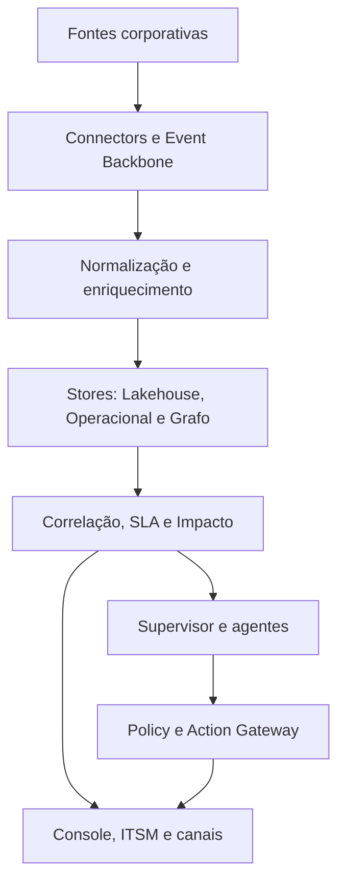

# Arquitetura de Referência

## Visão de contexto

Fontes corporativas enviam sinais para uma plataforma de ingestão e inteligência. Usuários acessam console, APIs e canais colaborativos. ITSM continua sendo o sistema operacional de tickets; scanners continuam sendo fontes especialistas.

## Containers lógicos

1. **Connector Plane** — adapters, polling/webhooks, checkpoints e redaction.
2. **Event Backbone** — transporte, schema registry, DLQ e replay.
3. **Normalization & Enrichment** — identidade de assets, ownership, classificação e contexto.
4. **Telemetry/Lakehouse** — histórico, baseline, analytics e evidência.
5. **Operational Store** — incidentes, policies, approvals e actions.
6. **Knowledge Graph** — topologia, ontologia, lineage e impacto.
7. **Correlation Engine** — dedup, anomalia, causality candidates e SLA prediction.
8. **AI Orchestrator** — supervisor, agentes e evaluation.
9. **Policy & Action Gateway** — autorização, approvals, execution e rollback.
10. **Experience Layer** — web, API, ITSM e canais.

## Fluxo principal

## Plano de controle e plano de dados

Control plane guarda tenants, connectors, policies, schemas e configurações. Data plane processa eventos, evidências e ações. Grandes clientes podem isolar data plane.

## Databricks vertical inicial

Ingestão periódica/streaming de Lakeflow/system tables, billing, compute e query history; Unity Catalog fornece catálogo/audit/lineage conforme disponibilidade. Notebooks/jobs e Git deployments são ligados por IDs, tags, job config e metadata CI/CD.

## Resiliência

- at-least-once e consumidores idempotentes;
- DLQ/quarantine;
- backpressure e rate limit;
- degradation sem LLM;
- cache de topologia;
- circuit breaker em connectors;
- replay por tenant/fonte/janela;
- reconcile jobs.

## Deployment

Ambientes dev/test/stage/prod, IaC, artefatos assinados, SBOM, progressive delivery e observability da própria plataforma. Regiões e residência de dados configuráveis.

## Trust boundaries

Fonte externa, connector runtime, event backbone, data stores, model providers, tool gateway, action executors e collaboration channels são limites distintos. Cada um exige autenticação, autorização, validação e logging.

