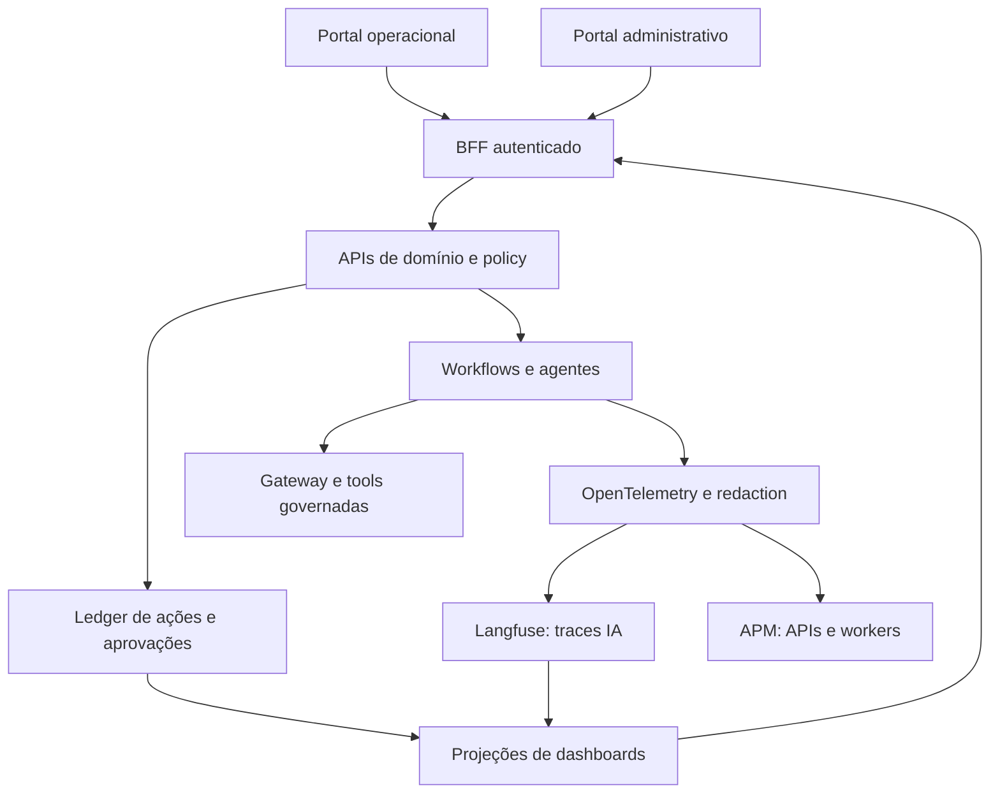

# Arquitetura dos portais e observabilidade

## Fronteiras

API de domínio continua autoritativa para estado de incidentes, planos e decisões. Dashboard é projeção e informa atraso. Langfuse investiga aplicação IA, não substitui auditoria. Unity Gateway aplica governança de serviços Databricks conforme capabilities. Integrações usam identidades distintas.

## Fluxo de atualização

Transação persiste ação/evento e outbox → consumer deduplica → atualiza read model → stream sinaliza mudança → portal consulta estado atualizado. Dados Langfuse enriquecem o detalhe após ingestão; ausência de trace não remove ação do painel. Billing atualiza custos reconciliados em cadência própria.

## Modelo de implantação

Iniciar com dois shells no mesmo projeto de frontend e BFF comum; separar deploy se necessário por organização. Backend não compartilha credenciais com browser. Langfuse Cloud ou self-hosted é decisão de implantação pendente de região, edição, controles e custo. Não assumir instalação empresarial gratuita.

## Operação da observabilidade

Monitorar exporter por mecanismo independente do próprio Langfuse. Se ingestão cair, painel mostra lacuna e backlog. Se ledger obrigatório falhar, escrita privilegiada para. Auditoria inclui também mudanças nos parâmetros de observabilidade e visualização de payload sensível.
