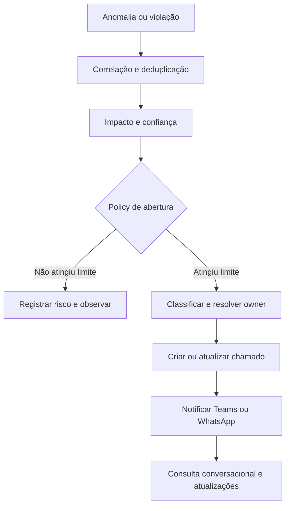

# SPEC-011 — Abertura Automática de Chamados e Agente Conversacional

## Objetivo

Quando a plataforma identificar um possível incidente com confiança e impacto acima dos limites configurados, criar ou atualizar um chamado no ITSM, classificar severidade/prioridade, atribuir o grupo responsável e permitir que gestores consultem a situação por WhatsApp ou Teams.

## Sistemas-alvo

ServiceNow, Jira Service Management ou adapter equivalente. O ITSM continua como sistema de registro oficial quando assim definido pela organização; a EICT mantém correlação, evidências e estado de sincronização.

## Fluxo de detecção até chamado



## Condições de abertura

Policy configurável combina:

- tipo de evento/anomalia;
- ambiente;
- criticidade do asset;
- severidade técnica;
- impacto de negócio;
- probabilidade de SLA breach;
- confiança da correlação;
- recorrência;
- horário/janela operacional;
- existência de incidente correlacionado ativo.

Sinais de baixa confiança podem gerar `risk candidate` ou alerta de observação sem abrir ticket. Uma violação determinística crítica, como secret confirmado ou contrato crítico quebrado, pode abrir chamado independentemente de modelo probabilístico.

## Classificação

### Severidade

Mede intensidade do efeito observado: indisponibilidade, degradação, integridade, segurança e extensão.

### Prioridade

Combina severidade, urgência, criticidade do processo, clientes, SLA, receita/custo em risco, exposição regulatória e capacidade de workaround.

Exemplo configurável:

| Prioridade | Critério resumido | Resposta |
|---|---|---|
| P1 | Processo crítico parado, segurança crítica ou impacto material amplo | War room e escalonamento imediato |
| P2 | Degradação relevante ou SLA crítico em risco | Atendimento urgente |
| P3 | Impacto limitado com workaround | Fila normal priorizada |
| P4 | Baixo impacto/informativo | Backlog |

A classificação deve exibir fatores e policy version. O gestor autorizado pode reclassificar com justificativa auditada.

## Conteúdo do chamado

- ID de correlação EICT;
- título e descrição objetiva;
- serviço/aplicação/pipeline;
- ambiente;
- severidade e prioridade explicadas;
- início e detecção;
- impacto observado/estimado;
- SLA/ETA e risco de breach;
- evidências principais;
- hipótese de RCA com confiança e rótulo `suspected`;
- mudanças recentes;
- dependentes afetados;
- grupo/owner;
- recomendação e runbook;
- link para investigação detalhada.

## Deduplicação e sincronização

- `correlation_key` impede tickets duplicados para a mesma condição ativa.
- Nova evidência atualiza o ticket existente.
- Estado, assignment e comentários são sincronizados conforme matriz de ownership.
- Conflitos usam version/timestamp e regras de precedência.
- Falha do ITSM entra em retry com backoff e DLQ; o incidente interno continua válido.
- Reabertura ocorre quando a condição retorna dentro da janela configurada.

## Agente no Teams/WhatsApp

### Perguntas suportadas

- “Qual é o status do INC-9271?”
- “O que está ameaçando a operação hoje?”
- “Por que o customer_360 está atrasado?”
- “Qual o impacto no financeiro?”
- “Quem está atuando e qual o ETA?”
- “O que mudou antes do incidente?”
- “Quais chamados P1 estão abertos?”
- “Existe risco de o SLA das 8h estourar?”

### Estrutura da resposta

1. estado e horário da informação;
2. impacto;
3. owner/atendimento;
4. SLA/ETA;
5. fatos confirmados;
6. hipótese de causa e confiança;
7. ação atual/próximo passo;
8. link ou comando permitido.

Exemplo:

```text
INC-9271 — Customer 360
Prioridade: P1 | Status: Em investigação
SLA restante: 37 min | ETA atual: 08:17
Impacto: dashboard comercial e 3 campanhas em risco.
Fato: Stage 17 está 171% acima do baseline, com 41 GB de spill.
Hipótese: data skew após novo join (confiança 91%, ainda não confirmada).
Owner: Data Engineering. Última atualização: 10:21 UTC.
Próximo passo: validar cardinalidade e estratégia de repartition.
```

## Identidade e autorização nos canais

- vincular identidade do canal à identidade corporativa;
- não confiar apenas no número do telefone ou nome exibido;
- aplicar RBAC/ABAC e classificação a cada pergunta;
- ocultar evidências, clientes, PII e segurança conforme permissão;
- step-up authentication para informação sensível ou ações;
- usuários não reconhecidos recebem resposta mínima e fluxo de validação.

## Comandos de alteração

O MVP é consulta e atualização simples autorizada: `ack`, comentário, assignment e status proposto. Aprovação, reclassificação crítica ou execução exige interactive approval autenticado. Mensagem livre nunca dispara ação privilegiada diretamente.

## Proteções contra prompt injection

Texto de usuários, tickets e documentos é conteúdo não confiável. O agente não aceita instruções que alterem policy, revelem secrets ou ampliem acesso. Toda tool call passa pelo gateway e registra decisão.

## Notificações proativas

- abertura P1/P2;
- alteração relevante de impacto/ETA/RCA;
- SLA prestes a violar;
- owner sem acknowledgement;
- recuperação e validação;
- solicitação de aprovação.

Notificações respeitam subscriptions, quiet hours, severidade e anti-spam.

## Critérios de aceite

1. Mesmo incidente não cria tickets duplicados.
2. Prioridade apresenta fatores e policy version.
3. Falha do ITSM não perde incidente nem evidência.
4. Pergunta no canal retorna informação atual e permissionada.
5. Hipótese nunca é declarada causa confirmada.
6. Usuário sem acesso não recebe detalhes sensíveis.
7. Toda resposta material referencia incidente/evidências e horário.
8. Comandos privilegiados exigem aprovação/autenticação apropriada.
9. Atualizações do canal entram na timeline com autoria.
10. Recuperação sincroniza ticket somente após critérios de validação.

## Extensão de remediação aprovada

SPEC-014 rege execução L2: solicitação autenticada pelo canal, aprovação vinculada ao plano, executor restrito, verificação independente, contingência e sincronização do fechamento. Respostas livres não autorizam alteração privilegiada. Falha ou impossibilidade mantém o chamado aberto com motivo, owner e próximo passo.

## Indicadores operacionais

Ticket automation rate, duplicate rate, classification override rate, sync latency, unanswered question rate, response factuality, channel adoption, acknowledgement time e unauthorized disclosure rate.
